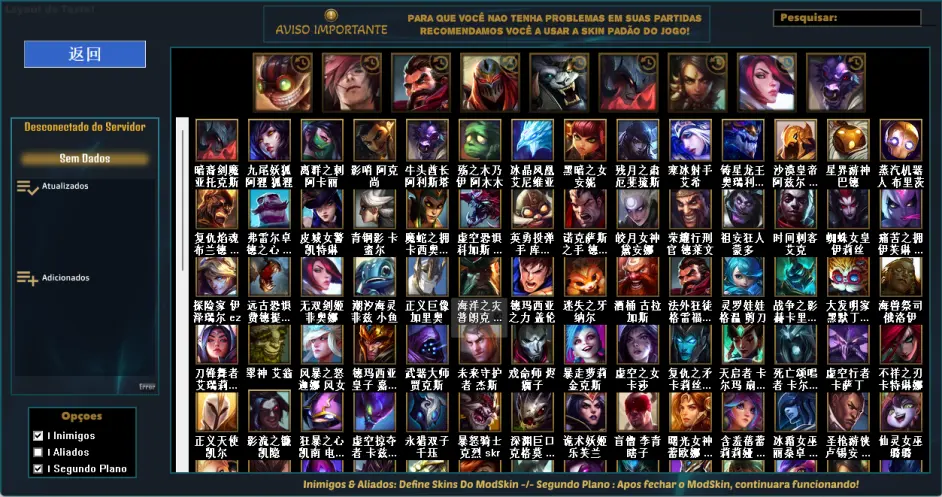

 **L.S.P.UT** 
基于LOLSKIN进行了优化，并重新设计了UI，而且最重要的：使用该软件不会触发闪退机制！经过本人几天的测试，从大乱斗到排位都可以正常使用。

不过由于该软件是给巴西服客户端用的，没有LOLSKIN里的语言设置，只有巴西语。不过巧的是我之前做一键更新的小工具时有研究过LOLSKIN的配置文件，可以从配置文件里设置默认语言，再把我之前修改过的中文配置文件放进来，解决了问题还让大家在搜索英雄时更方便了。

这里提供官网和我的修改版，要是对中文不感兴趣的话直接去官网下就好了

使用方法：

下载软件安装包：

官网：https://modskinbr.github.io/L.S.P.-UT

汉化版：https://gitee.com/zheng_rj/lsp.-ut/releases

安装：

如果从官网下载的话，下载的是安装包把它解压到任意地方，运行程序就会把主程序安装到C:\Fraps下，安装完成后就可以把解压出来的安装包删掉了。

汉化版是压缩包，直接将压缩包内的文件解压到C:\Fraps下即可。

需要注意的是从官网下载的安装包会比压缩包大，是因为我把软件里的皮肤预览图片删掉了，所有的预览图片有440MB我无法上传到码云，只能通过网盘分享： https://pan.baidu.com/s/1nC9vF9y5MgIF1UtuGAQS9Q?pwd=prhf 提取码: prhf

将压缩包中的图片放到C:\Fraps\data\Lib\cache下即可。

使用：

打开C:\Fraps\data\Lib\cache\L.S.P.UT.exe，使用方法和LOLSKIN区别不大。 作者：J_EnJay https://www.bilibili.com/read/cv16214990#reply113953097296 出处：bilibili